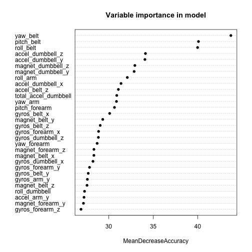

Practical Machine Learning Course Project -- B. A. Benayoun
========================================================
## Background
In this project, we tried to use data from accelerometers on the belt, forearm, arm, and dumbell of 6 participants that were asked to perform barbell lifts correctly and incorrectly in 5 different ways to determine whether personal fitness tracking devices could be used to determine the form (i.e. how well the exercise is done) of an exerciser. This dataset is originally from *http://groupware.les.inf.puc-rio.br/har*, and was obtained from the Coursera website. We used a Random Forest model because of its known performance abilities in general. We find that we can predict rather accurately (~99% accuracy in a test/validation sample) barbell lifting form based on fitness tracking devices.

## Exploratory analysis and data pre-processing


First, we load the caret package and read in memory the training dataset.

```r
library('caret')
```

```
## Warning: package 'caret' was built under R version 3.1.2
```

```
## Loading required package: lattice
## Loading required package: ggplot2
```

```r
# read file in
my.har.training <- read.csv('pml-training.csv',header=TRUE)

dim(my.har.training)
```

```
## [1] 19622   160
```

```r
#summary(my.har.training)
```

There are 160 variables and 19622 measurements. However, looking at a summary of the data (here commented out for report brevity), we notice that a number of variables seem to have more than 19000 NA values, either depicted as "NA", the empty string "" or "#DIV/0!" which need to be excluded, as then can't be too informative in the model building.


```r
my.notUsable <- rep(FALSE,160)
for (i in 1:160) {
  if (sum(my.har.training[,i] %in% NA) > 19000) {
    my.notUsable[i] <- TRUE
  }
  if (sum(my.har.training[,i] %in% "") > 19000) {
    my.notUsable[i] <- TRUE
  }
  if (sum(my.har.training[,i] %in% "#DIV/0!") > 19000) {
    my.notUsable[i] <- TRUE
  }
}
sum(my.notUsable)
```

```
## [1] 100
```

Let's now exlude the 100 NA-rich variables, as well as the first five columns, which should not be used for the model because they would be irrelevant to our question: these seem to be linked to time of day and date where the measurements were taken (i.e. **timestamp** values and window values), name of exerciser and the number of the measurement.

```r
my.clean.training <- data.frame(my.har.training[,-c(which(my.notUsable))])
colnames(my.clean.training)
```

```
##  [1] "X"                    "user_name"            "raw_timestamp_part_1"
##  [4] "raw_timestamp_part_2" "cvtd_timestamp"       "new_window"          
##  [7] "num_window"           "roll_belt"            "pitch_belt"          
## [10] "yaw_belt"             "total_accel_belt"     "gyros_belt_x"        
## [13] "gyros_belt_y"         "gyros_belt_z"         "accel_belt_x"        
## [16] "accel_belt_y"         "accel_belt_z"         "magnet_belt_x"       
## [19] "magnet_belt_y"        "magnet_belt_z"        "roll_arm"            
## [22] "pitch_arm"            "yaw_arm"              "total_accel_arm"     
## [25] "gyros_arm_x"          "gyros_arm_y"          "gyros_arm_z"         
## [28] "accel_arm_x"          "accel_arm_y"          "accel_arm_z"         
## [31] "magnet_arm_x"         "magnet_arm_y"         "magnet_arm_z"        
## [34] "roll_dumbbell"        "pitch_dumbbell"       "yaw_dumbbell"        
## [37] "total_accel_dumbbell" "gyros_dumbbell_x"     "gyros_dumbbell_y"    
## [40] "gyros_dumbbell_z"     "accel_dumbbell_x"     "accel_dumbbell_y"    
## [43] "accel_dumbbell_z"     "magnet_dumbbell_x"    "magnet_dumbbell_y"   
## [46] "magnet_dumbbell_z"    "roll_forearm"         "pitch_forearm"       
## [49] "yaw_forearm"          "total_accel_forearm"  "gyros_forearm_x"     
## [52] "gyros_forearm_y"      "gyros_forearm_z"      "accel_forearm_x"     
## [55] "accel_forearm_y"      "accel_forearm_z"      "magnet_forearm_x"    
## [58] "magnet_forearm_y"     "magnet_forearm_z"     "classe"
```

```r
my.clean.training <- my.clean.training[,-(1:7)]
```

We have 53 variables left: 52 potential high-quality predictors and 1 output variable ("classe"). Now, we examine the independance or correlation of the remaining variables to estimate how much information would be provided for model construction.

```r
library('pheatmap')
pheatmap(cor(my.clean.training[,-53]+0))
```

 

We see that some of the variables are very correlated (e.g. 'gyros_forearm_y' and 'gyros_dumbell_z'), but we may increase bias in the model by dropping them. Including them may increase variance, we will keep them to avoid increasing the bias. We also decide against using a PCA transformation of the variables to consolidate correlated vairables, which would decrease the interpretability of the model.

## Model fitting
Here, we decide to use Random Forests to learn a classifier of barbell form, because this algorithm is one of the best performers that are still interpretable (i.e. we can see which variables help the model make decisions). Random Forests are also more robust to correlated variables. To ensure a robust choice of model parameters and reasonnable computing time, we use 5-fold cross validation.

```r
# split data into training and testing/validation sets
my.final.training <- createDataPartition(my.clean.training$classe, p=0.75, list=FALSE)
har.training <- my.clean.training[my.final.training,]
har.testing <- my.clean.training[-my.final.training,]

# set a seed for the random number generator for reproducibility of numerical results
set.seed(123456)

# use 5-fold cross-validation to build the model
my.ctrl.opt <- trainControl(method = "cv", number = 5)

# train model with caret train function
my.rf.fit <- train(har.training$classe ~ ., method="rf",data=har.training,importance=TRUE,trControl = my.ctrl.opt)
```

```
## Loading required package: randomForest
## randomForest 4.6-10
## Type rfNews() to see new features/changes/bug fixes.
```

Now, let's examine the model built by this call.

```r
my.rf.fit$finalModel
```

```
## 
## Call:
##  randomForest(x = x, y = y, mtry = param$mtry, importance = TRUE) 
##                Type of random forest: classification
##                      Number of trees: 500
## No. of variables tried at each split: 2
## 
##         OOB estimate of  error rate: 0.64%
## Confusion matrix:
##      A    B    C    D    E  class.error
## A 4183    1    0    0    1 0.0004778973
## B   15 2824    9    0    0 0.0084269663
## C    0   17 2548    2    0 0.0074016362
## D    0    0   37 2371    4 0.0169983416
## E    0    0    2    6 2698 0.0029563932
```


We had 500 trees in the model. The random forest produces an OOB estimate of error rate of 0.6386737 %, corresponding to an OOB accuracy of 99.3613263%. However, to get an estimate of the **real** error of the model, we use the testing/validation sample that we obtained by partitionning the data pre-training of the model, and whose real class labels are known.


```r
# predict on the partionned testing/validation data
my.rf.preds <- predict(my.rf.fit, har.testing)
my.confus.mat <- confusionMatrix(har.testing$classe, my.rf.preds)
my.confus.mat
```

```
## Confusion Matrix and Statistics
## 
##           Reference
## Prediction    A    B    C    D    E
##          A 1393    2    0    0    0
##          B    2  947    0    0    0
##          C    0    7  848    0    0
##          D    0    0   17  787    0
##          E    0    0    0    1  900
## 
## Overall Statistics
##                                          
##                Accuracy : 0.9941         
##                  95% CI : (0.9915, 0.996)
##     No Information Rate : 0.2845         
##     P-Value [Acc > NIR] : < 2.2e-16      
##                                          
##                   Kappa : 0.9925         
##  Mcnemar's Test P-Value : NA             
## 
## Statistics by Class:
## 
##                      Class: A Class: B Class: C Class: D Class: E
## Sensitivity            0.9986   0.9906   0.9803   0.9987   1.0000
## Specificity            0.9994   0.9995   0.9983   0.9959   0.9998
## Pos Pred Value         0.9986   0.9979   0.9918   0.9789   0.9989
## Neg Pred Value         0.9994   0.9977   0.9958   0.9998   1.0000
## Prevalence             0.2845   0.1949   0.1764   0.1607   0.1835
## Detection Rate         0.2841   0.1931   0.1729   0.1605   0.1835
## Detection Prevalence   0.2845   0.1935   0.1743   0.1639   0.1837
## Balanced Accuracy      0.9990   0.9950   0.9893   0.9973   0.9999
```


Using data that was not used to build the model, we find an out-of-sample accuracy of 99.408646%. Thus it seems that we have built a high performance model, with high accuracy that is validated even using data that was not included in the training phase.

We can also examine variable importance to see which variables contributed most to the final model:

```r
varImpPlot(my.rf.fit$finalModel, sort = TRUE, type = 1, pch = 16, bg = "red", cex = 1, main = "Variable importance in model")
```

 

## Prediction on the unknown testing data
Now that we know that our model performs reasonnably well, we can use it to predict the class labels of the unknown samples provided in the assignment: we use our model on the provided 'test' dataset, which is processed similarly to our training set, and output the required files.


```r
my.har.testing <- read.csv('pml-testing.csv',header=TRUE)

# Select the same variables than in the training phase
my.clean.testing <- data.frame(my.har.testing[,-c(which(my.notUsable))])
my.clean.testing <- my.clean.testing[,-(1:7)]

# run predictions
my.test.preds <- as.character(predict(my.rf.fit, my.clean.testing))
# we don't show the results of these predictions here to adhere with the Coursera code of honor.
```

## Conclusion
We used Random Forests on accelerometer data to attempt to build a predictive model of whether wearers were using good form or not while lifting a barbell. Our model performed well in term of OOB accuracy, but also according to an out-of-sample validation set whose class labels (i.e. form while lifting the barbell) were already know. Finally, it seems that the model performs rather well also on unlabeled data in a 3rd independent dataset provided for prediction, since according to the automatic grading, the predicted labels were all correct.
